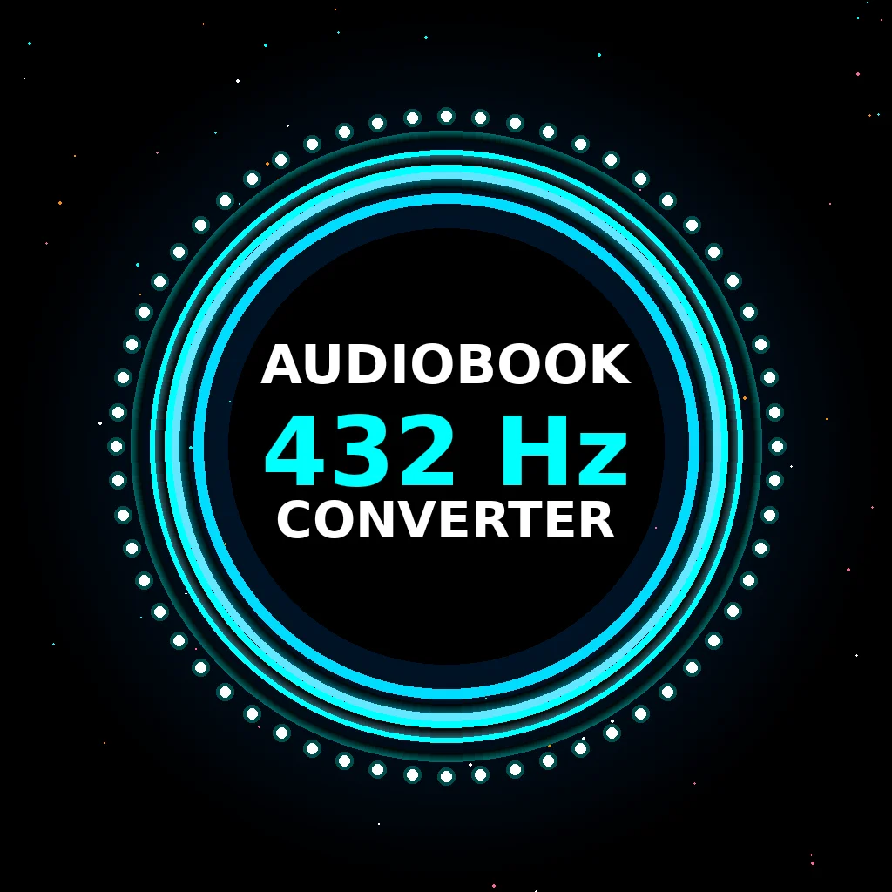

# 432 Hz AudioBook Converter 🎵

Transform text into healing audiobooks tuned to sacred frequencies. Convert any text to speech with solfeggio frequency enhancement for meditation, spiritual practice, and healing.



## ✨ Features

### 🎧 Core Features
- **Text-to-Speech Conversion**: Convert any text into natural-sounding speech
- **Sacred Frequency Tuning**: Choose from 8 solfeggio frequencies (396-963 Hz)
- **Multiple Voice Options**: Support for all browser-native voices
- **Adjustable Speech Speed**: 0.75x to 2x playback speeds
- **Background Music**: Optional ambient music (Sun Salutation & Rumi Dreams)

### 🎵 Solfeggio Frequencies
- **396 Hz** - Liberation from Fear & Guilt
- **417 Hz** - Facilitating Change
- **432 Hz** - Universal Harmony (Default)
- **528 Hz** - Love & DNA Repair
- **639 Hz** - Connecting Relationships
- **741 Hz** - Expression & Solutions
- **852 Hz** - Returning to Spiritual Order
- **963 Hz** - Divine Consciousness

### 🌑 Special Features
- **Black Screen Listening Mode**: Fullscreen distraction-free listening with screen wake lock
- **Project Saving**: Save your favorite texts for later
- **Real-time Waveform**: Visual audio feedback
- **Responsive Design**: Works on desktop, tablet, and mobile

## 🚀 Live Demo

Visit the live app: [https://balaram-app.github.io/432-hz-audiobook-converter/](https://balaram-app.github.io/432-hz-audiobook-converter/)

## 💻 Technology Stack

- **Frontend**: Pure HTML5, CSS3, JavaScript (ES6+)
- **Audio**: Web Speech API for text-to-speech
- **Fonts**: Google Fonts (Orbitron, Rajdhani)
- **Storage**: LocalStorage for project persistence

## 📦 Installation

### Option 1: Use Online (Recommended)
Simply visit the [live demo](https://balaram-app.github.io/432-hz-audiobook-converter/)

### Option 2: Run Locally
```bash
# Clone the repository
git clone https://github.com/balaram-app/432-hz-audiobook-converter.git

# Navigate to directory
cd 432-hz-audiobook-converter

# Open index.html in your browser
# Or use a local server:
python -m http.server 8000
# Then visit: http://localhost:8000
```

## 🎯 How to Use

1. **Enter Your Text**: Paste or type any text (spiritual texts, affirmations, mantras, stories)
2. **Select Voice**: Choose from available system voices
3. **Choose Frequency**: Pick a solfeggio frequency (default: 432 Hz)
4. **Adjust Settings**: Set speech speed and optional background music
5. **Generate**: Click "Generate Audio" and listen
6. **Black Screen Mode**: Enter fullscreen distraction-free listening mode

## 📊 Free Tier Limits

- **Daily Conversions**: 5 per day
- **Character Limit**: 5,000 characters per conversion
- **Features**: All frequencies, all voices, basic features

## ⚡ Pro Features (Coming Soon)

- Unlimited daily conversions
- 50,000 character limit
- Download as MP3 files
- Premium voice options (ElevenLabs integration)
- Batch processing
- Cloud storage
- Commercial usage rights

## 🎨 Design Philosophy

This app uses sacred geometry principles and cosmic color schemes to create a spiritually aligned user experience:

- **Cosmic Color Palette**: Turquoise, purple, gold, and white
- **Animated Backgrounds**: Pulsing cosmic gradients and particle effects
- **Sacred Typography**: Orbitron and Rajdhani fonts
- **Minimalist Interface**: Focus on the healing experience

## 🔧 Browser Compatibility

- ✅ Chrome/Edge (Recommended)
- ✅ Firefox
- ✅ Safari
- ⚠️ Internet Explorer (Not supported)

**Note**: Voice quality and availability vary by browser and operating system.

## 📱 Mobile Support

Fully responsive design optimized for:
- iOS Safari
- Android Chrome
- Tablet devices

## 🤝 Contributing

Contributions are welcome! Here's how:

1. Fork the repository
2. Create a feature branch (`git checkout -b feature/AmazingFeature`)
3. Commit your changes (`git commit -m 'Add AmazingFeature'`)
4. Push to branch (`git push origin feature/AmazingFeature`)
5. Open a Pull Request

## 📝 Roadmap

- [ ] Cloud TTS integration (ElevenLabs, Google Cloud TTS)
- [ ] MP3 export functionality
- [ ] More background music options
- [ ] Batch text processing
- [ ] Voice cloning features
- [ ] Multi-language support
- [ ] Audio effects (reverb, echo)
- [ ] Playlist creation

## 🐛 Known Limitations

1. **No MP3 Export**: Browser Web Speech API doesn't support direct audio file export. Cloud TTS integration coming soon.
2. **Voice Quality**: Depends on browser's built-in voices. Premium voices planned for Pro version.
3. **Background Music**: Placeholder URLs need to be replaced with actual audio files.

## 📄 License

This project is licensed under the MIT License - see the [LICENSE](LICENSE) file for details.

## 👤 Author

**Balaram**
- GitHub: [@balaram-app](https://github.com/balaram-app)

## 🙏 Acknowledgments

- Sacred geometry and solfeggio frequency research
- Vedic spiritual traditions
- Open source community
- Web Speech API contributors

## 💫 Support

If you find this project helpful, please:
- ⭐ Star this repository
- 🐛 Report bugs via [Issues](https://github.com/balaram-app/432-hz-audiobook-converter/issues)
- 💡 Suggest features
- 📢 Share with others on your spiritual journey

---

**Created with Sacred Geometry and Love Frequency** 🎵

*Transform your reading into healing sound experiences.*
